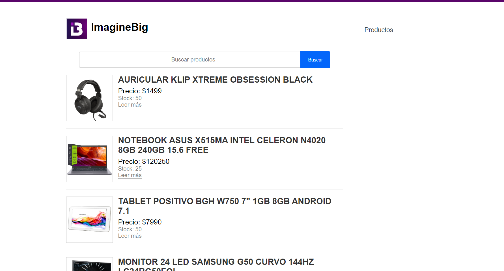
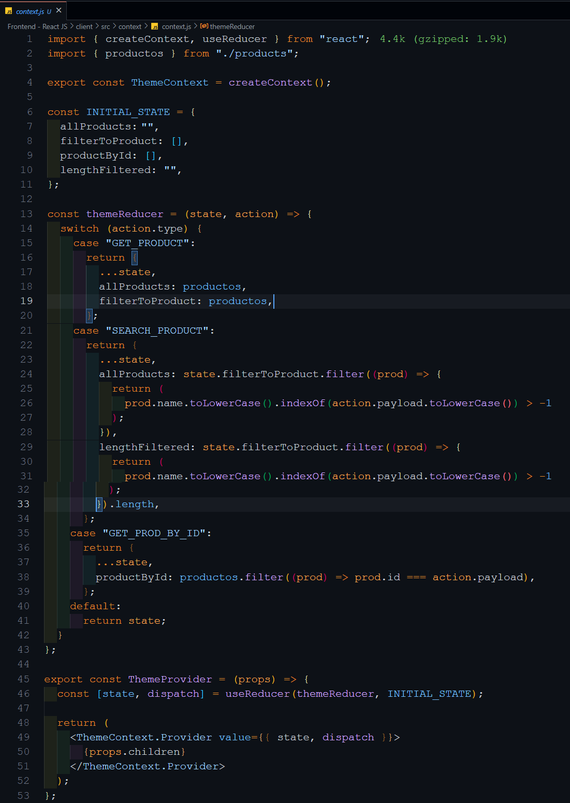
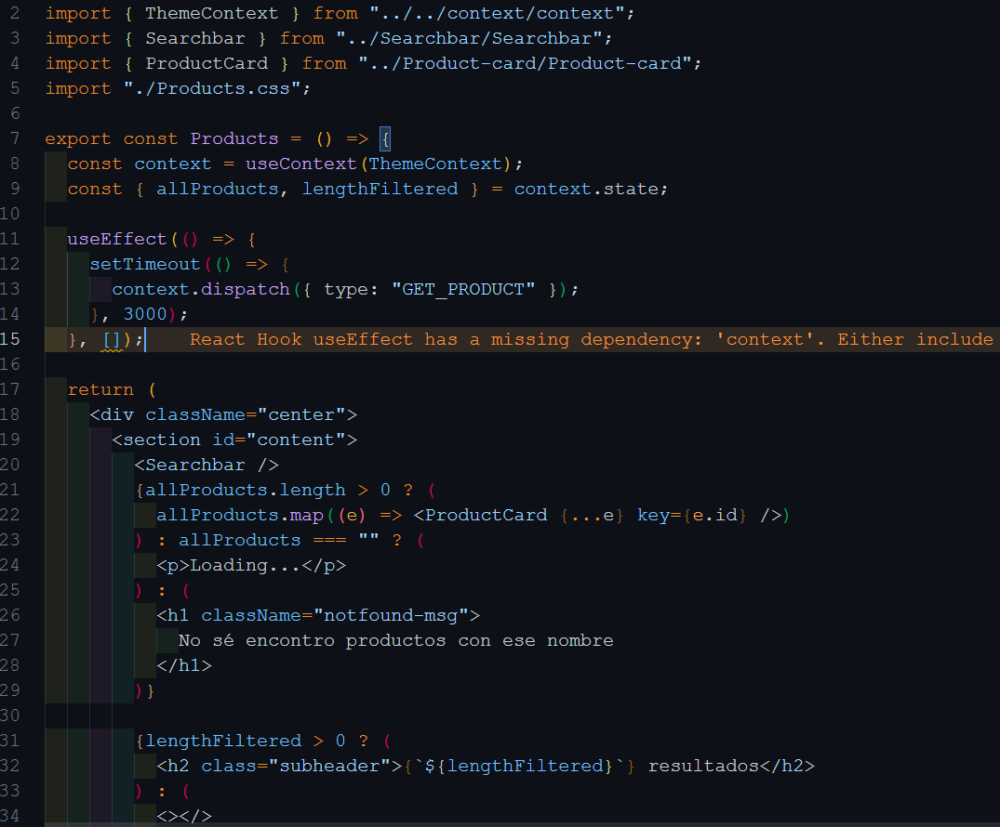

## Challenge Frontend - ImagineBig

<p align="left">
  
</p>


## Objetivos del Challenge.

    ✅ Según el diseño de figma, plasmar en código, un listado de productos con búsqueda por nombre y código de producto. Los productos pueden venir de un array almacenado en una variable.

    ✅ Simular un tiempo de respuesta de 3 segundos con un setTimeOut Se valora el manejo de estados entre componentes, uso de hooks y estilos.


## Objetivos extras que me parecieron divertidos de realizar.

    ✅ Acceso a detalles de cada producto para que el usuario pueda saber más sobre el producto que desee comprar.
    c
    ✅ La misma cuenta con responsive web desing adaptado a todo tipo de pantalla (me gusto mucho más como quedo la versión mobile que la desktop).


## Tecnologias utilizadas 💻

<div align="left">  
<a href="https://reactjs.org/" target="_blank"></a>  
<a href="https://en.wikipedia.org/wiki/HTML5" target="_blank"></a>  
<a href="https://www.javascript.com/" target="_blank"></a>  
<a href="https://www.w3schools.com/css/" target="_blank"></a>  
</div>


## Requisitos para ejecutarla localmente ⚙

Instalacion ⚙:

Utilizar el administrador de paquetes npm para instalar. Utilizar el siguiente comando dentro de ./Frontend - React JS/client:

```
npm install ⚙
```


## Ejecutar local ⚙

-FrontEnd: Dentro ./client:

```
npm start
```


## Hablemos un poco de código y funcionalidades 💻:

<p align="left">
  
</p>
En mi archivo "context.js" cree un contexto global a través de hooks de react para traerme la información de los productos, y además, para también modificar esa información que guardo en el mismo a través del uso del useReducer.

Cada CASE hace lo siguiente:
    ✅ GET_PRODUCT: Es lo que me permite traerme la información de los productos y valorizar lo que contengo en mi contexto global con los mismos.
    ✅ SEARCH_PRODUCT: Esta tiene 2 funcionalidades, la primera es la de buscar productos por nombre ya sea si el usuario ingresa letras mayusculas o mínusculas filtrando sobre lo que contengo en mi contexto global, y la segunda es la de guardarme la longitud del arreglo que me provee, para así renderizar un mensaje con el número de productos que se encontro.
    ✅ GET_PROD_BY_ID: Por último, esta es la que me permite ingresar a la información detallada de cada producto, para así brindarle al usuario una manera de leer la descripción del producto que le haya interesado.

## ¿Porqué use contexto global y no me comunique entre componentes a través de props y uso de el estado local?:

A lo largo de mi carrera como desarrollador, me di cuenta que mienrtas menos cargado este lo que contiene mis componentes, mi código queda mucho más modularizado y le permite entender al otro desarrollador de una manera mucho más sencilla lo que busco hacer.


## ¿Cómo maneje las respuestas que me pidieron?

<p align="left">
  
</p>

El mi componente Products use el setTimeOut para simular esos 3 segundos para traerme la información cómo me lo pidieron, y las respuestas las maneje de una manera sencilla, si recibo un arreglo que contiene al menos 1 elemento, renderizo los productos, en caso de que ese arreglo sea igual a un string vació (el valor que tiene inicialmente en mi contexto global) quiero que me cargue un loading para que el usuario sepa que los productos se estan cargando, y en caso de no contener nada, ni ser un string vacio, que devuelva el mensaje de que no se encontro el producto buscado.

## ¿Cómo me traje los productos?

Sencillo :D despachando la acción de mi reducer que me permite traerme todos los productos dentro de useEffect para que la misma se ejecute cada que se ingrese al componente, en este caso, no le pase dependencia porque no la necesita ya que los productos que me traigo no van a cambiar.

## Detalles de los productos
<p align="left">
  
</p>

Aquí la cosa si fue un poco distinta pero nada de otro mundo, a través del hook de useParams que me provee react-router-dom me traje el id que reciba en la url, despache la acción para traerme la información de 1 solo producto dentro del useEffect (a la que le pase por "payload"(parámetro) el id), y le coloque cómo dependencia el ID ya que cada producto tiene un ID distinto, y eso debe de cambiar cada que se ingrese a un producto.


# Espero lo disfruten y mi challenge sea de vuestro agrado, muchas gracias por la oportunidad... 😉